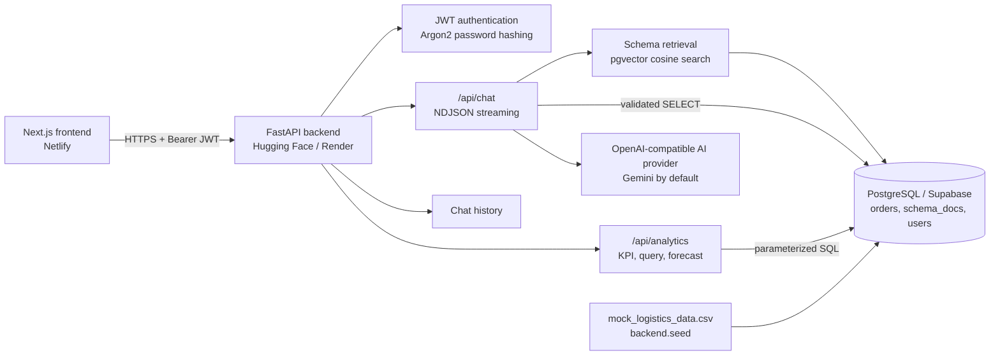
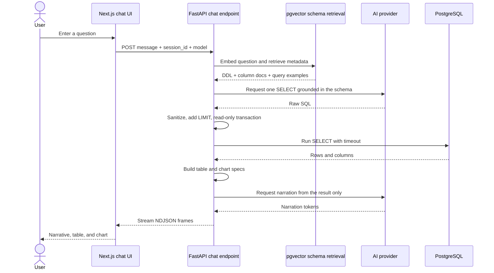
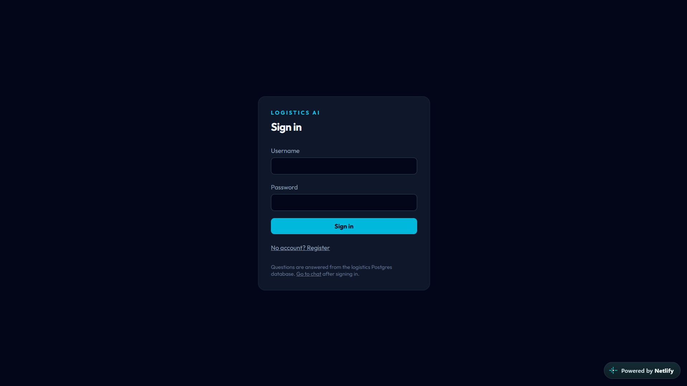
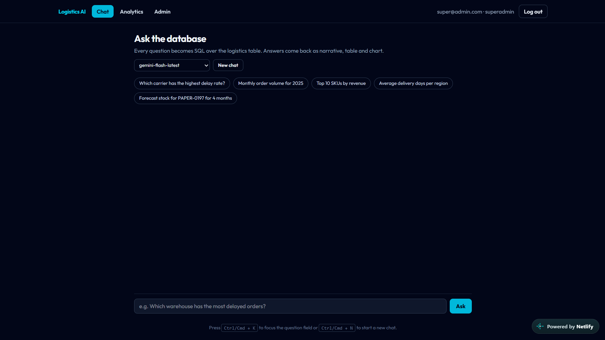
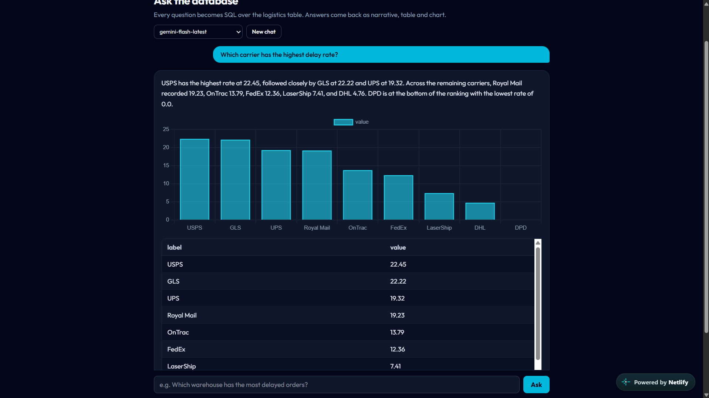
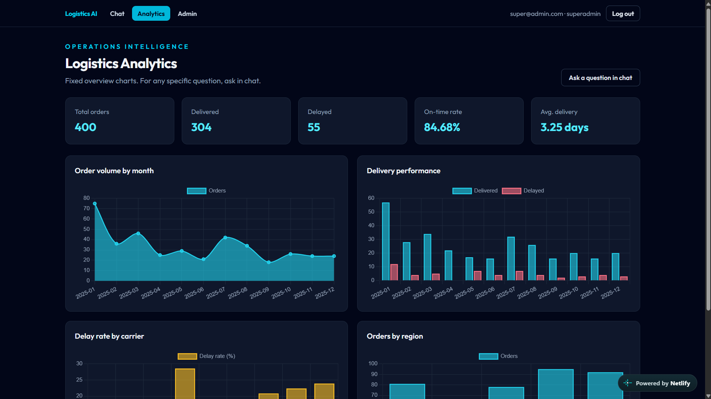

# Logistics Analytics — text-to-SQL over Postgres

Ask the logistics database in plain language. Every question is translated into
SQL, executed against Postgres, and answered with a narrative, a table and a
chart. `mock_logistics_data.csv` is the single source of truth: it is seeded into
Postgres, and nothing else feeds the answers.

- **API** — FastAPI, API-only (no server-rendered HTML).
- **UI** — Next.js app in `frontend/`, deployed to Netlify.
- **Data** — Postgres (Supabase in production) + `pgvector`.
- **Retrieval** — pgvector stores *schema metadata only*, so the model knows the
  columns and their allowed values before it writes SQL. There is no document
  upload and no Chroma.

## Arsitektur



### Responsibility Split

**Backend** lives in `backend/` and owns data access, authorization, SQL
validation, analytics, forecasting, and history persistence.

- `main.py` provides FastAPI routes, CORS, startup migrations, chat streaming,
  history, analytics, authentication, and admin endpoints.
- `database.py` creates the SQLAlchemy engine and session from `DATABASE_URL`.
- `models_db.py` defines the `User`, `ChatSession`, `ChatMessage`, `Order`, and
  `SchemaDoc` models.
- `seed.py` loads the CSV into `orders` and creates embeddings for schema
  metadata.
- `ddl_docs.py`, `schema_docs.py`, and `vectorstore.py` build and retrieve
  schema context with pgvector.
- `sql_agent.py` generates SQL, applies read-only guardrails, executes queries,
  and emits `sql`, `table`, `chart`, `token`, and `done` frames.
- `analytics.py` runs controlled KPI/analytics queries and stock forecasts.
- `auth.py` manages password hashing, JWTs, and role checks.
- `history.py` stores chat turns and their result payloads.

**Frontend** lives in `frontend/` and owns the user experience and result
rendering.

- `app/login` handles login and registration.
- `app/(app)/chat` handles questions, model selection, sessions, NDJSON
  streaming, tables, charts, and SQL details.
- `app/(app)/dashboard` displays fixed operational KPIs and charts.
- `app/(app)/admin` provides user management for administrators.
- `components/` contains the navbar, Chart.js canvas, and data table.
- `lib/api.ts` manages the bearer token in `localStorage`.
- `lib/frames.ts` parses the NDJSON stream from the chat endpoint.

## Workflow

### Authentication

1. The user signs in through `POST /api/auth/token` or registers through
   `POST /api/auth/register`.
2. The backend verifies the password and returns a JWT with the user's role.
3. The frontend stores the token and sends it as
   `Authorization: Bearer <token>`.
4. `NavBar` validates the token through `GET /api/users/me`; invalid tokens are
   cleared and the user is redirected to `/login`.
5. The backend remains the source of truth for current-user, admin, and
   superadmin authorization.

### Chat Question Flow



  Query safety rules:

  - only one `SELECT`/`WITH` statement is accepted;
  - mutation/DDL keywords and risky functions are rejected;
  - queries run inside a `READ ONLY` transaction;
  - queries without `LIMIT` are capped at 200 rows;
  - `SQL_TIMEOUT_MS` limits execution time;
  - narration may only use numbers from the query result.

  Forecast questions such as `forecast stock for PAPER-0197 for 4 months` use a
  deterministic path: the system calculates a three-month moving average, creates
  the projection, and applies a 15% safety buffer. This path does not ask the
  model to generate forecast SQL.

  ### Analytics and History

  The dashboard calls `/api/analytics/kpis` and `/api/analytics/query` on load.
  All KPIs and charts are calculated directly by `LogisticsAnalytics` from
  PostgreSQL; specific questions remain in the chat workflow.

  The frontend stores one `session_id` in `localStorage` so history survives a
  reload. The backend associates each session with its owner and rejects access
  from other users. Every user and assistant turn is stored in `chat_messages`
  with the table, chart, SQL, or forecast metadata payload.

## Technology Stack

| Area | Technology | Role |
| --- | --- | --- |
| Backend API | Python 3.11+, FastAPI, Uvicorn | REST API and streaming responses |
| Database access | SQLAlchemy, psycopg 3 | Engine, sessions, ORM, and SQL |
| Database | PostgreSQL 15+ / Supabase | Orders, users, sessions, history, and metadata |
| Vector search | pgvector | Cosine search for schema metadata |
| AI integration | OpenAI-compatible API, Gemini default | SQL, embeddings, and narration |
| Authentication | python-jose, Argon2, bcrypt compatibility | JWT and password hashing |
| Frontend | Next.js 16, React 19, TypeScript 5 | UI and client-side fetching |
| Styling | Tailwind CSS 4 | Layout and styling |
| Visualization | Chart.js 4 | Line and bar charts |
| Deployment | Docker, Hugging Face Spaces, Netlify, Render | Application hosting |
| Testing | Python `unittest` | Backend tests with an AI stub |

## Layout

```
app.py                    dev entry point for the API
mock_logistics_data.csv   source of truth, 400 orders
backend/
  main.py                 FastAPI routes (chat, analytics, auth, history)
  database.py             engine/session from DATABASE_URL
  models_db.py            User, ChatSession, ChatMessage, Order, SchemaDoc
  seed.py                 CSV -> orders, schema docs -> pgvector
  schema_docs.py          the 24 metadata documents that get embedded
  vectorstore.py          pgvector cosine search
  sql_agent.py            question -> SQL -> narrative + table + chart frames
  analytics.py            fixed KPI/chart queries (pure SQL)
  history.py              chat turns persisted in Postgres
frontend/                 Next.js frontend
tests/                    25 unittest tests
```

## Prerequisites

- Python 3.11+
- Node 20+
- A Postgres 15+ database with the `vector` extension available

## 1. Database

Production is Supabase; `pgvector` is already available there. For local work,
one container is enough:

```powershell
docker run -d --name pgvec -e POSTGRES_PASSWORD=devpass -e POSTGRES_DB=logistics -p 55432:5432 pgvector/pgvector:pg17
```

## 2. Backend

```powershell
py -3 -m venv .venv
.\.venv\Scripts\Activate.ps1
pip install -r requirements.txt
Copy-Item .env.example .env   # then fill in API_KEY and DATABASE_URL
python -m backend.seed
python app.py
```

`python -m backend.seed` creates the extension and tables, loads the CSV and
embeds the schema metadata. Expect:

```
orders: 400 rows loaded
schema_docs: 24 documents embedded
```

Re-running it is safe — `orders` is truncated and reloaded, `schema_docs` is
replaced. Add `--no-vectors` to load the orders without spending embedding
calls. The API then listens on <http://127.0.0.1:8000> (`/docs` for the OpenAPI
page).

> Use `127.0.0.1` rather than `localhost` in `DATABASE_URL` on Windows; the IPv6
> lookup for `localhost` can add ~26 s to every connection.

## 3. Frontend

```powershell
cd frontend
npm install
Copy-Item .env.example .env.local
npm run dev
```

Open <http://localhost:3000>. It redirects to `/chat`, which is the only place
questions are asked. Register an account on first use.

| Route | Purpose |
| --- | --- |
| `/chat` | Ask anything. Streams narrative + table + chart, keeps history. |
| `/dashboard` | Fixed KPI cards and charts only — no input fields. |
| `/admin` | User list, create user, change role. Admins only. |

## Application Screenshots

### Login



*Caption: Login page for authenticating users before they access chat, analytics,
and administration features.*

### Chat Workspace



*Caption: Chat workspace with sample questions, AI model selection, a new-chat
control, and the input for questions about the logistics database.*

### Chat Answer



*Caption: A text-to-SQL answer showing the narrative, carrier delay-rate chart,
query result table, and the option to inspect generated SQL.*

### Dashboard Analytics



*Caption: Operations dashboard with total orders, delivered, delayed, on-time
rate, and average delivery KPIs, plus volume and delivery-performance charts.*

## How to Use

The live frontend is available at <https://logistics-ai.netlify.app/>. The
backend Space is <https://huggingface.co/spaces/arifsoul/chatbot_rag>.

1. Open the frontend and sign in, or select **Register** to create an account.
2. On `/chat`, choose a sample question or type a question about the logistics
  database, then select **Ask**.
3. Read the generated narrative and inspect the returned chart and table. Open
  **Show SQL** when you need to review the generated read-only query.
4. Use **New chat** to start a new session. The current session history is
  restored after a page reload for the same browser account.
5. Open **Analytics** for fixed KPI and operational charts.
6. Users with the `admin` or `superadmin` role can open **Admin** to manage
  users, roles, and password resets.

Example questions:

```text
Which carrier has the highest delay rate?
Monthly order volume for 2025
Average delivery days per region
Forecast stock for PAPER-0197 for 4 months
```

## Environment variables

Backend (`.env`, read by `backend/ai_config.py` and `backend/database.py`):

| Variable | Notes |
| --- | --- |
| `API_KEY` | Key for the AI provider. Google AI Studio: <https://aistudio.google.com/apikey> |
| `AI_BASE_URL` | Any OpenAI-compatible base URL. Defaults to Google AI Studio. |
| `AI_MODEL` | Default chat model, e.g. `gemini-flash-latest`. The chat UI can override per request. |
| `EMBEDDING_MODEL` | Embedding model for the schema metadata, e.g. `gemini-embedding-001`. |
| `EMBEDDING_DIM` | Vector width of that model. `3072` for `gemini-embedding-001`. Changing it requires a re-seed. |
| `DATABASE_URL` | `postgresql+psycopg://...` — the driver must be psycopg 3. |
| `SQL_TIMEOUT_MS` | Hard ceiling on any generated query. Default `5000`. |
| `CORS_ORIGINS` | Comma-separated browser origins allowed to call the API. |
| `SECRET_KEY` | JWT signing secret. Set a long random value in production. |
| `SUPER_USERNAME`, `SUPER_PASSWORD` | Optional initial superadmin, applied on startup. |

Frontend (`frontend/.env.local`):

| Variable | Notes |
| --- | --- |
| `NEXT_PUBLIC_API_URL` | Origin of the API. Defaults to `http://127.0.0.1:8000`. |

## How a question is answered

1. The question is embedded and matched against the schema metadata in
   `pgvector`, which yields the relevant columns and their real values.
2. The model writes one `SELECT`. `backend/sql_agent.py` rejects anything else,
   forces a `LIMIT`, and applies `SQL_TIMEOUT_MS`.
3. Postgres executes it. The rows — not the model — are the numbers.
4. The API streams NDJSON frames (`sql`, `table`, `chart`, `token`, `meta`,
   `done`) so the UI fills in as the answer arrives.
5. Both turns are written to `chat_messages`, so reloading `/chat` replays the
   exact same narrative, table and chart.

Stock questions ("forecast stock for SKU-x for 4 months") take a separate path: a
three-month moving average with a 15% safety buffer, returned as actual +
forecast rows.

## Tests

```powershell
python -W ignore::ResourceWarning -m unittest discover -s tests
```

25 tests. They stub the AI provider, so no API key or network access is needed.

## Deploy

**Backend — Hugging Face Spaces (Docker)** — this repository is ready to deploy as a Docker Space:

1. Create a new Space at https://huggingface.co/new-space with SDK `Docker` and the `Blank` template.
2. Push this repository to the Space (`git push` to `https://huggingface.co/spaces/<user>/<space>`). Hugging Face builds the `Dockerfile` automatically and exposes port `7860`.
3. In the Space **Settings → Variables and secrets**, set:
   ```
   DATABASE_URL=postgresql+psycopg://... (Supabase pooler)
   API_KEY=<google_ai_studio_key>
   AI_BASE_URL=https://generativelanguage.googleapis.com/v1beta/openai/
   AI_MODEL=gemini-flash-latest
   EMBEDDING_MODEL=gemini-embedding-001
   EMBEDDING_DIM=3072
   SECRET_KEY=<random_long>
   CORS_ORIGINS=https://<your-netlify>.netlify.app,https://<user>-<space>.hf.space
   SUPER_USERNAME=admin
   SUPER_PASSWORD=admin
   ```
4. Seed Supabase once: `DATABASE_URL=<supabase> python -m backend.seed`.
5. Use the Space URL as `NEXT_PUBLIC_API_URL` for the frontend. Health checks are `GET /` and `/docs`.

The `Dockerfile` runs `uvicorn backend.main:app --host 0.0.0.0 --port $PORT` (`$PORT=7860` on Hugging Face). The `sdk: docker` and `app_port: 7860` frontmatter is already present in `README.md`.

**Backend — alternative (Render / another host)** — any ASGI host:

```
uvicorn backend.main:app --host 0.0.0.0 --port 8000
```

Run `python -m backend.seed` once against Supabase. Add the frontend origin to `CORS_ORIGINS`.

**Frontend** — Netlify picks up `frontend/netlify.toml` (base `frontend`, `@netlify/plugin-nextjs`). Set `NEXT_PUBLIC_API_URL` in Netlify to the API origin (the HF Space URL or Render URL).

## Assumptions and limitations

- On-time rate is `delivered / (delivered + delayed)`; in-transit, exception and
  canceled orders are excluded.
- Average delivery days uses delivered rows that have both dates.
- Forecasting is a planning baseline, not an inventory optimizer.
- The API has no rate limiting. Put it behind a gateway if it is public.
- Generated SQL is restricted to a single read-only `SELECT` on `orders`, but the
  database user should still be read-only in production.
