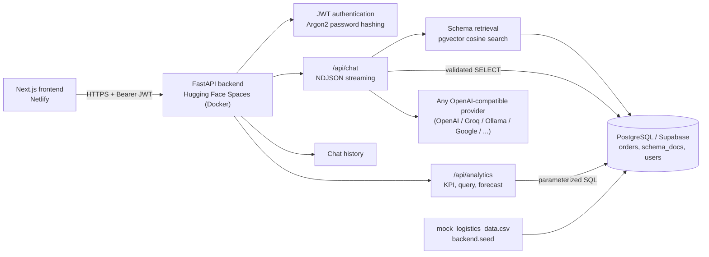
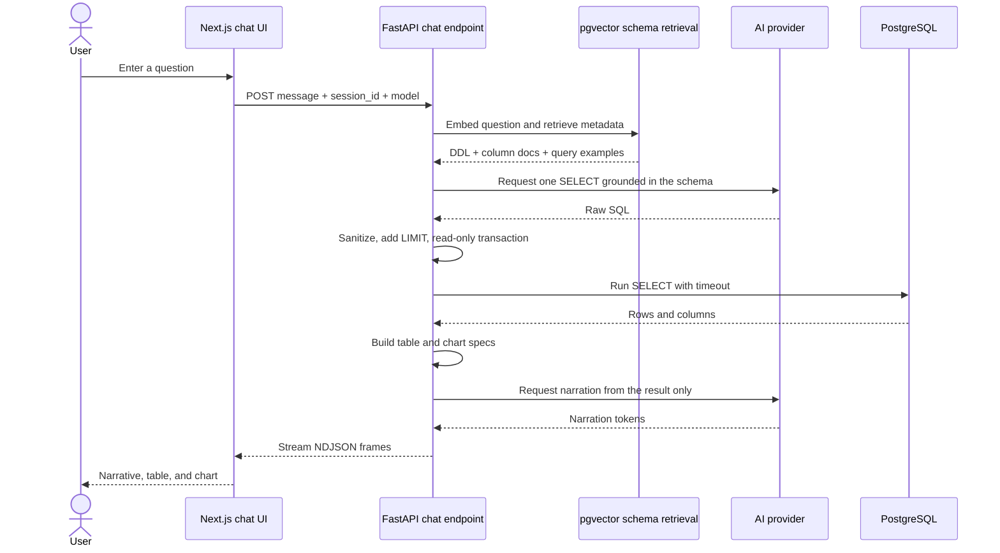

# Logistics Analytics — text-to-SQL over Postgres

Ask the logistics database in plain language. Every question is translated into
SQL, executed against Postgres, and answered with a narrative, a table and a
chart. `mock_logistics_data.csv` is the single source of truth: it is seeded into
Postgres, and nothing else feeds the answers.

- **API** — FastAPI, API-only (no server-rendered HTML).
- **UI** — Next.js app in `frontend/`, deployed to Netlify.
- **Data** — Postgres (Supabase in production) + `pgvector`.
- **Retrieval** — pgvector stores *schema metadata only*, so the model knows the
  columns and their allowed values before it writes SQL. There is no document
  upload and no Chroma.

## Arsitektur



### Responsibility Split

**Backend** (`backend/`) — data access, auth, SQL safety, analytics, history.

- `main.py` — FastAPI routes: `POST /api/chat` (NDJSON stream), `GET/POST /api/analytics/*`, `POST /api/auth/token|register`, `GET /api/users/me`, `GET/POST /api/users`, `PUT /api/users/{id}/role`, `POST /api/users/{id}/reset-password`, `DELETE /api/users/{id}`, `GET/POST /api/history`, CORS, startup `CREATE EXTENSION vector` + `Base.metadata.create_all`.
- `database.py` — SQLAlchemy engine/session from `DATABASE_URL`, `SQL_TIMEOUT_MS` statement timeout.
- `models_db.py` — `User` (role: user/admin/superadmin), `ChatSession`, `ChatMessage` (payload: table/chart/sql/forecast), `Order` (400 rows), `SchemaDoc` (vector 3072).
- `models.py` — Pydantic schemas for requests/responses.
- `seed.py` — `mock_logistics_data.csv` → `orders` (truncate+reload), 24 schema docs → pgvector embeddings, `--superadmin-password` for `super@admin.com`, `--no-vectors` to skip embeddings.
- `ddl_docs.py` / `schema_docs.py` / `vectorstore.py` — DDL reference, 24 metadata docs, `get_doc`/`schema_context` cosine search.
- `sql_agent.py` — prompt with DDL+context → one SELECT/WITH → `FORBIDDEN` regex + `READ ONLY` transaction + `LIMIT 200` + `SQL_TIMEOUT_MS` → execute → table/chart spec → narration prompt (numbers only from result) → `sql`/`table`/`chart`/`token`/`meta`/`done` frames.
- `analytics.py` — `LogisticsAnalytics.kpis()` / `query()` / `forecast()` — pure parameterized SQL, 3-month moving average + 15% buffer for forecast.
- `auth.py` + `roles.py` — Argon2/bcrypt hashing, `python-jose` JWT (`SECRET_KEY`, `ACCESS_TOKEN_EXPIRE_MINUTES`), `get_current_user`/`get_current_admin`/`get_current_superadmin`, `CANONICAL_SUPERADMIN_USERNAME="super@admin.com"`, `validate_role_change`/`can_delete_user`.
- `history.py` — persist `ChatSession`/`ChatMessage` per user, enforce ownership.
- `ai_config.py` — `API_KEY` (`GROQ_API_KEY` fallback) / `AI_BASE_URL` / `AI_MODEL` / `EMBEDDING_MODEL` / `EMBEDDING_DIM` via `openai_client()` — any OpenAI-compatible endpoint (OpenAI, Groq, OpenRouter, Ollama, vLLM, LM Studio, Google AI Studio, …). Defaults to `gemini-flash-latest` / `gemini-embedding-001` dim 3072.
- `cors.py` — `get_allowed_origins()` from `CORS_ORIGINS`.

**Frontend** (`frontend/`) — Next.js 16 App Router, client-side fetching, no SSR data.

- `app/page.tsx` — redirect `/` → `/chat`.
- `app/login/page.tsx` — login/register toggle, `POST /api/auth/token` (form-encoded) / `POST /api/auth/register`, `setSession(token, role)` in `localStorage`.
- `app/(app)/layout.tsx` + `components/NavBar.tsx` — auth gate, `GET /api/users/me` validation, clear + redirect to `/login` on 401, role-based nav (Admin visible only for admin/superadmin).
- `app/(app)/chat/page.tsx` — sample questions, model selector (`GET /api/models`), `session_id` in `localStorage` (`crypto.randomUUID()`), `POST /api/chat` NDJSON streaming via `readFrames`, renders narrative + `DataTable` + `ChartCanvas` + SQL drawer, `GET /api/history` replay on reload.
- `app/(app)/dashboard/page.tsx` — `GET /api/analytics/kpis` + `POST /api/analytics/query` (orders/month, delivered/month, delayed/month, carrier, region), KPI cards + Chart.js.
- `app/(app)/admin/page.tsx` — `GET /api/users`, `POST /api/users` (form-encoded), `PUT /api/users/{id}/role`, `POST /api/users/{id}/reset-password`, `DELETE /api/users/{id}`; superadmin badge (no select), hide self-delete, hide reset for superadmin.
- `components/ChartCanvas.tsx` — Chart.js 4.5.0 wrapper, destroy on cleanup.
- `components/DataTable.tsx` — table for query rows.
- `lib/api.ts` — `API_URL` from `NEXT_PUBLIC_API_URL`, `TOKEN_KEY`/`ROLE_KEY` in `localStorage`, `apiFetch` (Bearer), `api<T>` (JSON + `ApiError`), `login`/`register`/`me`/`getRole`.
- `lib/frames.ts` — NDJSON `sql`/`table`/`chart`/`token`/`meta`/`done`/`error` frames, `readFrames` async generator.

## Workflow

### Authentication

1. The user signs in through `POST /api/auth/token` or registers through
   `POST /api/auth/register`.
2. The backend verifies the password and returns a JWT with the user's role.
3. The frontend stores the token and sends it as
   `Authorization: Bearer <token>`.
4. `NavBar` validates the token through `GET /api/users/me`; invalid tokens are
   cleared and the user is redirected to `/login`.
5. The backend remains the source of truth for current-user, admin, and
   superadmin authorization.

### Chat Question Flow



  Query safety rules:

  - only one `SELECT`/`WITH` statement is accepted;
  - mutation/DDL keywords and risky functions are rejected;
  - queries run inside a `READ ONLY` transaction;
  - queries without `LIMIT` are capped at 200 rows;
  - `SQL_TIMEOUT_MS` limits execution time;
  - narration may only use numbers from the query result.

  Forecast questions such as `forecast stock for PAPER-0197 for 4 months` use a
  deterministic path: the system calculates a three-month moving average, creates
  the projection, and applies a 15% safety buffer. This path does not ask the
  model to generate forecast SQL.

  ### Analytics and History

  The dashboard calls `/api/analytics/kpis` and `/api/analytics/query` on load.
  All KPIs and charts are calculated directly by `LogisticsAnalytics` from
  PostgreSQL; specific questions remain in the chat workflow.

  The frontend stores one `session_id` in `localStorage` so history survives a
  reload. The backend associates each session with its owner and rejects access
  from other users. Every user and assistant turn is stored in `chat_messages`
  with the table, chart, SQL, or forecast metadata payload.

## Technology Stack

| Area | Technology | Role |
| --- | --- | --- |
| Backend API | Python 3.11+, FastAPI, Uvicorn | REST API + NDJSON streaming (`backend/main.py`) |
| Database access | SQLAlchemy 2.x, psycopg 3 (`psycopg[binary]`) | Engine, sessions, ORM |
| Database | PostgreSQL 15+ / Supabase + `vector` extension | `orders`, `users`, `chat_sessions`, `chat_messages`, `schema_docs` |
| Vector search | pgvector (`vectorstore.py`, `schema_docs.py`) | Cosine search schema metadata only (24 docs) |
| AI integration | Any OpenAI-compatible API (`backend/ai_config.py`) — OpenAI, Groq, OpenRouter, Ollama, vLLM, LM Studio, Google AI Studio, … | SQL generation, embeddings, narration. Defaults to `gemini-flash-latest` / `gemini-embedding-001` (dim 3072) |
| SQL safety | `backend/sql_agent.py` guardrails + `READ ONLY` transaction + `SQL_TIMEOUT_MS` | Single SELECT/WITH, LIMIT 200, forbidden keywords |
| Authentication | python-jose, Argon2 (`argon2-cffi`), bcrypt, passlib | JWT (`SECRET_KEY`), hashed passwords, role checks (`backend/auth.py`, `backend/roles.py`) |
| Analytics | `backend/analytics.py` pure SQL | KPI, query, forecast (3-month MA + 15% buffer) |
| Frontend framework | Next.js 16.3.4, React 19.2.8, TypeScript 5 | App Router, client fetching (`frontend/lib/api.ts`, `frontend/lib/frames.ts`) |
| Styling | Tailwind CSS 4 (`@import "tailwindcss"` in `app/globals.css`) | Layout, no `tailwind.config.*` |
| Visualization | Chart.js 4.5.0 (`components/ChartCanvas.tsx`) | Line/bar, destroy on cleanup |
| Deployment | Docker (`Dockerfile` → `uvicorn backend.main:app --port $PORT`), Hugging Face Spaces (Docker, `app_port: 7860`), Netlify (`frontend/netlify.toml` + `@netlify/plugin-nextjs`) | Hosting |
| Testing | Python `unittest` (`tests/`, 25 tests, AI stub) | No API key needed |

## Layout

```
app.py                    dev entry point (uvicorn backend.main:app)
mock_logistics_data.csv   source of truth, 400 orders
Dockerfile  deploy config (Hugging Face Spaces Docker)
backend/
  main.py                 FastAPI routes: /api/chat (NDJSON), /api/analytics/*, /api/auth/*, /api/users/*, /api/history
  database.py             SQLAlchemy engine/session from DATABASE_URL, SQL_TIMEOUT_MS
  models_db.py            User, ChatSession, ChatMessage, Order, SchemaDoc (pgvector)
  models.py               Pydantic request/response schemas
  seed.py                 CSV -> orders (truncate+reload), schema_docs -> pgvector embeddings, superadmin seed
  schema_docs.py          24 metadata documents (columns, values, examples) that get embedded
  ddl_docs.py             DDL reference + cached_ddl for prompt
  vectorstore.py          pgvector cosine search (get_doc, schema_context)
  sql_agent.py            question -> SQL (guardrails) -> execute READ ONLY -> table+chart -> narration frames
  analytics.py            LogisticsAnalytics: fixed KPI/chart SQL (pure parameterized SQL)
  auth.py                 Argon2/bcrypt hashing, JWT create/verify, get_current_user/admin/superadmin
  roles.py                CANONICAL_SUPERADMIN_USERNAME, validate_role_change, can_delete_user
  history.py              chat turns persisted in chat_messages
  ai_config.py            OpenAI-compatible client (API_KEY, AI_BASE_URL, AI_MODEL, EMBEDDING_MODEL/DIM)
  cors.py                 get_allowed_origins from CORS_ORIGINS
  rag.py / runtime.py     retrieval helpers / runtime config
frontend/                 Next.js 16 App Router
  app/page.tsx            root redirect -> /chat
  app/login/page.tsx      login + register toggle
  app/(app)/layout.tsx    auth gate (NavBar)
  app/(app)/chat/page.tsx question input, model select, NDJSON streaming, table/chart/SQL
  app/(app)/dashboard/page.tsx  KPI cards + charts (calls /api/analytics/*)
  app/(app)/admin/page.tsx      user CRUD, role change, reset password (admin/superadmin only)
  components/NavBar.tsx   nav + token validation via /api/users/me
  components/ChartCanvas.tsx  Chart.js wrapper (destroy on cleanup)
  components/DataTable.tsx    result table
  lib/api.ts              API_URL, token/role in localStorage, apiFetch/api, login/register/me
  lib/frames.ts           NDJSON frame types + readFrames async generator
  netlify.toml            base frontend, @netlify/plugin-nextjs
tests/                    25 unittest tests (AI stub, no network)
schema_sql/               orders.sql + orders.comments.json (DDL source)
docs/screenshots/         login.png, room_chat.png, answer_chat.png, analytics_dashboard.png
```

## Prerequisites

- Python 3.11+
- Node 20+
- A Postgres 15+ database with the `vector` extension available

## 1. Database

Production is Supabase; `pgvector` is already available there. For local work,
one container is enough:

```powershell
docker run -d --name pgvec -e POSTGRES_PASSWORD=devpass -e POSTGRES_DB=logistics -p 55432:5432 pgvector/pgvector:pg17
```

## 2. Backend

```powershell
py -3 -m venv .venv
.\.venv\Scripts\Activate.ps1
pip install -r requirements.txt
Copy-Item .env.example .env   # then fill in API_KEY and DATABASE_URL
python -m backend.seed
python app.py
```

`python -m backend.seed` creates the extension and tables, loads the CSV and
embeds the schema metadata. Expect:

```
orders: 400 rows loaded
schema_docs: 24 documents embedded
```

Re-running it is safe — `orders` is truncated and reloaded, `schema_docs` is
replaced. Add `--no-vectors` to load the orders without spending embedding
calls. The API then listens on <http://127.0.0.1:8000> (`/docs` for the OpenAPI
page).

Seed or reset the protected superadmin password directly in PostgreSQL:

```powershell
python -m backend.seed --superadmin-password "choose-a-strong-password"
```

This creates or updates `super@admin.com`, stores an Argon2 hash in
`users.hashed_password`, and assigns the `superadmin` role. The application does
not read the superadmin password from environment variables.

> Use `127.0.0.1` rather than `localhost` in `DATABASE_URL` on Windows; the IPv6
> lookup for `localhost` can add ~26 s to every connection.

## 3. Frontend

```powershell
cd frontend
npm install
Copy-Item .env.example .env.local
npm run dev
```

Open <http://localhost:3000>. It redirects to `/chat`, which is the only place
questions are asked. Register an account on first use.

| Route | Purpose |
| --- | --- |
| `/chat` | Ask anything. Streams narrative + table + chart, keeps history. |
| `/dashboard` | Fixed KPI cards and charts only — no input fields. |
| `/admin` | User list, create user, change role. Admins only. |

## Application Screenshots

### Login


*Caption: Login page for authenticating users before they access chat, analytics,
and administration features.*

### Chat Workspace


*Caption: Chat workspace with sample questions, AI model selection, a new-chat
control, and the input for questions about the logistics database.*

### Chat Answer


*Caption: A text-to-SQL answer showing the narrative, carrier delay-rate chart,
query result table, and the option to inspect generated SQL.*

### Dashboard Analytics


*Caption: Operations dashboard with total orders, delivered, delayed, on-time
rate, and average delivery KPIs, plus volume and delivery-performance charts.*

## How to Use

The live frontend is available at <https://logistics-ai.netlify.app/>. The
backend Space is <https://huggingface.co/spaces/arifsoul/chatbot_rag>.

1. Open the frontend and sign in, or select **Register** to create an account.
2. On `/chat`, choose a sample question or type a question about the logistics
  database, then select **Ask**.
3. Read the generated narrative and inspect the returned chart and table. Open
  **Show SQL** when you need to review the generated read-only query.
4. Use **New chat** to start a new session. The current session history is
  restored after a page reload for the same browser account.
5. Open **Analytics** for fixed KPI and operational charts.
6. Users with the `admin` or `superadmin` role can open **Admin** to manage
  users, roles, and password resets.

Example questions:

```text
Which carrier has the highest delay rate?
Monthly order volume for 2025
Average delivery days per region
Forecast stock for PAPER-0197 for 4 months
```

## Environment variables

Backend (`.env`, read by `backend/ai_config.py` and `backend/database.py`):

| Variable | Notes |
| --- | --- |
| `API_KEY` | API key for the chosen provider (`API_KEY` preferred, `GROQ_API_KEY` fallback for legacy `.env`). |
| `AI_BASE_URL` | OpenAI-compatible base URL ending in `/v1` (or `/v1beta/openai/` for Google). Defaults to Google AI Studio. |
| `AI_MODEL` | Chat model ID for that provider (e.g. `gemini-flash-latest`, `gpt-4o-mini`, `llama-3.1-70b-versatile`). Chat UI can override per request via `GET /api/models`. |
| `EMBEDDING_MODEL` | Embedding model ID for that provider (e.g. `gemini-embedding-001`, `text-embedding-3-small`, `nomic-embed-text`). |
| `EMBEDDING_DIM` | Vector width of `EMBEDDING_MODEL` (e.g. `3072` for `gemini-embedding-001`, `1536` for `text-embedding-3-small`). Changing it requires `python -m backend.seed` to re-embed `schema_docs`. |
| `DATABASE_URL` | `postgresql+psycopg://...` — the driver must be psycopg 3. |
| `SQL_TIMEOUT_MS` | Hard ceiling on any generated query. Default `5000`. |
| `CORS_ORIGINS` | Comma-separated browser origins allowed to call the API. |
| `SECRET_KEY` | JWT signing secret. Set a long random value in production. |

Frontend (`frontend/.env.local`):

| Variable | Notes |
| --- | --- |
| `NEXT_PUBLIC_API_URL` | Origin of the API. Defaults to `http://127.0.0.1:8000`. |

## How a question is answered

1. The question is embedded and matched against the schema metadata in
   `pgvector`, which yields the relevant columns and their real values.
2. The model writes one `SELECT`. `backend/sql_agent.py` rejects anything else,
   forces a `LIMIT`, and applies `SQL_TIMEOUT_MS`.
3. Postgres executes it. The rows — not the model — are the numbers.
4. The API streams NDJSON frames (`sql`, `table`, `chart`, `token`, `meta`,
   `done`) so the UI fills in as the answer arrives.
5. Both turns are written to `chat_messages`, so reloading `/chat` replays the
   exact same narrative, table and chart.

Stock questions ("forecast stock for SKU-x for 4 months") take a separate path: a
three-month moving average with a 15% safety buffer, returned as actual +
forecast rows.

## Tests

```powershell
python -W ignore::ResourceWarning -m unittest discover -s tests
```

25 tests. They stub the AI provider, so no API key or network access is needed.

## Deploy

**Backend — Hugging Face Spaces (Docker)** — this repository is ready to deploy as a Docker Space:

1. Create a new Space at https://huggingface.co/new-space with SDK `Docker` and the `Blank` template.
2. Push this repository to the Space (`git push` to `https://huggingface.co/spaces/<user>/<space>`). Hugging Face builds the `Dockerfile` automatically and exposes port `7860`.
3. In the Space **Settings → Variables and secrets**, set (any OpenAI-compatible provider works):
   ```
   DATABASE_URL=postgresql+psycopg://... (Supabase pooler)
   API_KEY=<provider_api_key>              # OpenAI / Groq / OpenRouter / Google AI Studio / ...
   AI_BASE_URL=<openai_compatible_base_url>
   AI_MODEL=<chat_model_id>
   EMBEDDING_MODEL=<embedding_model_id>
   EMBEDDING_DIM=<vector_dim>
   SECRET_KEY=<random_long>
   CORS_ORIGINS=https://<your-netlify>.netlify.app,https://<user>-<space>.hf.space
   ```
   Examples — pick one provider (keep `EMBEDDING_DIM` matched to `EMBEDDING_MODEL`):
   ```
   # Google AI Studio (default)
   AI_BASE_URL=https://generativelanguage.googleapis.com/v1beta/openai/
   AI_MODEL=gemini-flash-latest
   EMBEDDING_MODEL=gemini-embedding-001
   EMBEDDING_DIM=3072

   # OpenAI
   AI_BASE_URL=https://api.openai.com/v1
   AI_MODEL=gpt-4o-mini
   EMBEDDING_MODEL=text-embedding-3-small
   EMBEDDING_DIM=1536

   # Groq
   AI_BASE_URL=https://api.groq.com/openai/v1
   AI_MODEL=llama-3.1-70b-versatile
   EMBEDDING_MODEL=nomic-embed-text  # or use OpenAI/Google for embeddings
   EMBEDDING_DIM=768

   # Local (Ollama / vLLM / LM Studio)
   AI_BASE_URL=http://host.docker.internal:11434/v1
   AI_MODEL=llama3.1
   EMBEDDING_MODEL=nomic-embed-text
   EMBEDDING_DIM=768
   ```
   After changing `EMBEDDING_MODEL`/`EMBEDDING_DIM`, re-seed: `python -m backend.seed`.
  The only protected superadmin username is `super@admin.com`; every other
  account may only use the `admin` or `user` role.
4. Seed Supabase once, including the superadmin password:
  `DATABASE_URL=<supabase> python -m backend.seed --superadmin-password "<strong-password>"`.
5. Use the Space URL as `NEXT_PUBLIC_API_URL` for the frontend. Health checks are `GET /` and `/docs`.

The `Dockerfile` runs `uvicorn backend.main:app --host 0.0.0.0 --port $PORT` (`$PORT=7860` on Hugging Face). The `sdk: docker` and `app_port: 7860` frontmatter is already present in `README.md`.

**Frontend** — Netlify picks up `frontend/netlify.toml` (base `frontend`, `@netlify/plugin-nextjs`). Set `NEXT_PUBLIC_API_URL` in Netlify to the HF Space URL.

## Assumptions and limitations

- On-time rate is `delivered / (delivered + delayed)`; in-transit, exception and
  canceled orders are excluded.
- Average delivery days uses delivered rows that have both dates.
- Forecasting is a planning baseline, not an inventory optimizer.
- The API has no rate limiting. Put it behind a gateway if it is public.
- Generated SQL is restricted to a single read-only `SELECT` on `orders`, but the
  database user should still be read-only in production.
