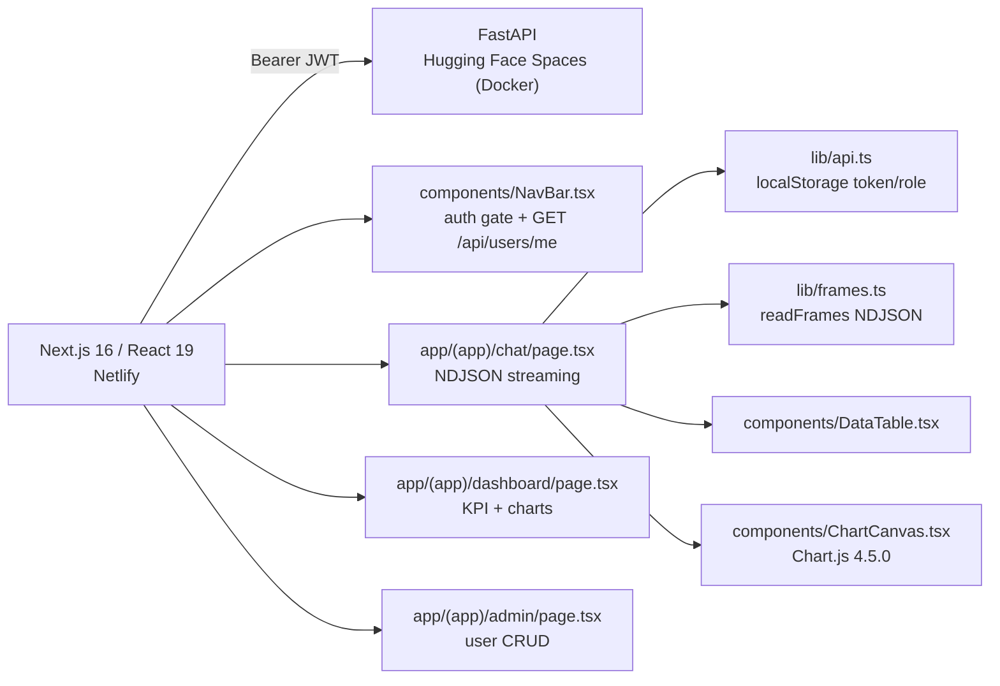

# frontend — Logistics AI frontend

Next.js 16 (App Router) UI for the FastAPI backend at the repo root. See the root `README.md` for the full stack and backend setup.

```powershell
npm install
Copy-Item .env.example .env.local   # NEXT_PUBLIC_API_URL
npm run dev
```

The backend must be running at `NEXT_PUBLIC_API_URL` (default `http://127.0.0.1:8000`) and that origin must be listed in the backend `CORS_ORIGINS`.

## Architecture



**Responsibility:** the frontend only renders and fetches client-side. All SQL, auth, and history live in the backend. `app/(app)/layout.tsx` + `NavBar` act as the gate: without a token the user is redirected to `/login`.

## Workflow

### Auth
1. `app/login/page.tsx` — login form. `POST /api/auth/token` (form-encoded `username` + `password`).
2. `lib/api.ts` `setSession(token, role)` stores `logistics_token` + `logistics_role` in `localStorage`.
3. `NavBar` validates via `GET /api/users/me`; 401 → `clearSession()` → redirect to `/login`. The backend is the source of truth for roles.

### Chat (Q&A)
1. The user picks a sample or types a question → `POST /api/chat` with `message` + `session_id` (`crypto.randomUUID()` in `localStorage` `logistics_session_id`) + `model`.
2. `lib/frames.ts` `readFrames` parses NDJSON `sql`/`table`/`chart`/`token`/`meta`/`done`/`error` as a stream.
3. Renders the narrative (token stream) + `DataTable` + `ChartCanvas` + SQL drawer. `GET /api/history` replays on reload.

### Dashboard
`useEffect` in parallel: `GET /api/analytics/kpis` + `POST /api/analytics/query` (orders/month, delivered/month, delayed/month, carrier, region). Pure SQL in the backend; the frontend only renders charts.

### Admin
- **User management** — `GET /api/users` list, `POST /api/users` (form-encoded), `PUT /api/users/{id}/role`, `POST /api/users/{id}/reset-password`, `DELETE /api/users/{id}`. Only admin/superadmin can access (redirects to `/chat` otherwise). The superadmin `super@admin.com` shows a badge and has no role select / delete / reset; self-delete hidden.
- **AI & Embedding config** — `GET /api/ai-config` + `PUT /api/ai-config` + `POST /api/ai-config/sync`. Separate `AI Base URL` / `Embedding Base URL` + `AI API Key` / `Embedding API Key` (empty = env fallback, Clear button), searchable `ModelCombobox` (`GET /api/models?kind=chat|embedding&base_url&api_key`), `Test model` (`GET /api/models/validate`), `Embedding Dim` auto-filled from `embedding_dims`, `Save` vs `Sync (save + re-seed vectors)`.

## Technology

| Area | Technology | Role |
| --- | --- | --- |
| Framework | Next.js 16.3.4, React 19.2.8, TypeScript 5 | App Router, client fetching |
| Styling | Tailwind CSS 4 (`@import "tailwindcss"` in `app/globals.css`, `@theme inline`) | Layout, no `tailwind.config.*` |
| Chart | Chart.js 4.5.0 (`components/ChartCanvas.tsx`, destroy on cleanup) | Line/bar |
| API client | `lib/api.ts` (`API_URL` from `NEXT_PUBLIC_API_URL`, `apiFetch` Bearer, `api<T>` + `ApiError`) | Auth + fetch |
| Streaming | `lib/frames.ts` (`readFrames` async generator) | NDJSON |
| Deploy | `netlify.toml` (base `frontend`, `npm run build`, `@netlify/plugin-nextjs`) | Netlify |

## Routes

| Route | Notes |
| --- | --- |
| `/` | Redirects to `/chat`. |
| `/login` | Sign-in form. |
| `/chat` | The only place to ask questions. Streams narrative + table + chart and saves history. |
| `/dashboard` | KPI cards + charts only, no input. |
| `/admin` | User list, create, change role, reset password. Admin/superadmin only. |

All routes under `app/(app)/` sit behind the `components/NavBar.tsx` gate.

## Structure

```
app/
  page.tsx                 redirect / -> /chat
  layout.tsx               root layout
  globals.css              @import "tailwindcss" + @theme inline
  login/page.tsx           sign-in
  (app)/layout.tsx         auth gate
  (app)/chat/page.tsx      chat + streaming + history
  (app)/dashboard/page.tsx KPI + charts
  (app)/admin/page.tsx     user management
components/
  NavBar.tsx               nav + session check + logout
  ChartCanvas.tsx          Chart.js wrapper
  DataTable.tsx            result table
lib/
  api.ts                   API_URL, token/role localStorage, apiFetch/api, login/me/getRole (register admin-only)
  frames.ts                NDJSON types + readFrames
netlify.toml               Netlify config
```

## Screenshots


*Login — authentication before accessing chat/analytics/admin.*


*Chat workspace — sample questions, model select, new chat, input.*


*Narrative + chart + table + Show SQL.*


*Dashboard — total/delivered/delayed/on-time rate/avg delivery + volume & performance charts.*


*Admin — user management (create, change role, reset password, delete; superadmin protected) and AI & Embedding config (separate base URLs + API keys with env fallback, searchable model dropdown, Test / Save / Sync with vector re-seed).*

> Hosted on Imgur; no local `docs/screenshots/*.png` needed.

## Scripts

```powershell
npm run dev     # Turbopack dev server -> http://localhost:3000
npm run lint    # eslint
npm run build   # production build
npx tsc --noEmit
```

## Deploy (Netlify)

`netlify.toml` set base `frontend`, `npm run build`, `@netlify/plugin-nextjs`.
Set `NEXT_PUBLIC_API_URL` in the Netlify env to the API origin (HF Space URL) and add the Netlify URL to the backend `CORS_ORIGINS`.
