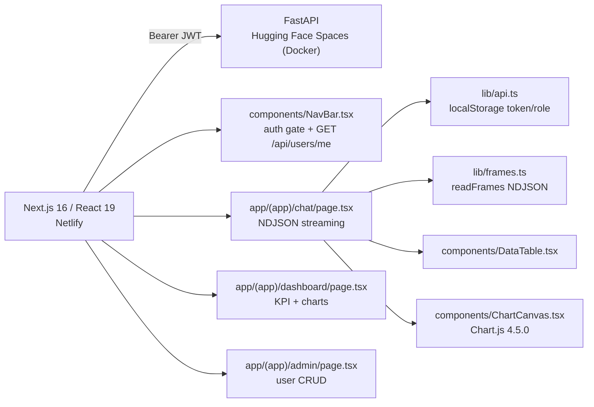

# frontend — Logistics AI frontend

Next.js 16 (App Router) UI for FastAPI backend di root repo. Lihat root `README.md` untuk stack lengkap + setup backend.

```powershell
npm install
Copy-Item .env.example .env.local   # NEXT_PUBLIC_API_URL
npm run dev
```

Backend harus jalan di `NEXT_PUBLIC_API_URL` (default `http://127.0.0.1:8000`) dan origin ini ada di `CORS_ORIGINS` backend.

## Arsitektur



**Responsibility:** frontend hanya render + fetch client-side. Semua SQL, auth, history di backend. `app/(app)/layout.tsx` + `NavBar` jadi gate: tanpa token redirect ke `/login`.

## Workflow

### Auth
1. `app/login/page.tsx` — toggle login/register. `POST /api/auth/token` (form-encoded `username`+`password`) atau `POST /api/auth/register`.
2. `lib/api.ts` `setSession(token, role)` simpan `logistics_token` + `logistics_role` di `localStorage`.
3. `NavBar` validasi via `GET /api/users/me`; 401 → `clearSession()` → redirect `/login`. Backend source of truth untuk role.

### Chat (tanya jawab)
1. User pilih sample atau ketik pertanyaan → `POST /api/chat` dengan `message` + `session_id` (`crypto.randomUUID()` di `localStorage` `logistics_session_id`) + `model`.
2. `lib/frames.ts` `readFrames` parse NDJSON `sql`/`table`/`chart`/`token`/`meta`/`done`/`error` secara streaming.
3. Render narrative (token stream) + `DataTable` + `ChartCanvas` + drawer SQL. `GET /api/history` replay saat reload.

### Dashboard
`useEffect` parallel: `GET /api/analytics/kpis` + `POST /api/analytics/query` (orders/month, delivered/month, delayed/month, carrier, region). Pure SQL di backend, frontend hanya chart.

### Admin
`GET /api/users` list, `POST /api/users` (form-encoded), `PUT /api/users/{id}/role`, `POST /api/users/{id}/reset-password`, `DELETE /api/users/{id}`. Hanya admin/superadmin bisa akses (redirect ke `/chat` jika bukan). Superadmin `super@admin.com` tampil badge, tidak ada select/delete/reset.

## Teknologi

| Area | Teknologi | Peran |
| --- | --- | --- |
| Framework | Next.js 16.3.4, React 19.2.8, TypeScript 5 | App Router, client fetching |
| Styling | Tailwind CSS 4 (`@import "tailwindcss"` di `app/globals.css`, `@theme inline`) | Layout, tanpa `tailwind.config.*` |
| Chart | Chart.js 4.5.0 (`components/ChartCanvas.tsx`, destroy on cleanup) | Line/bar |
| API client | `lib/api.ts` (`API_URL` dari `NEXT_PUBLIC_API_URL`, `apiFetch` Bearer, `api<T>` + `ApiError`) | Auth + fetch |
| Streaming | `lib/frames.ts` (`readFrames` async generator) | NDJSON |
| Deploy | `netlify.toml` (base `frontend`, `npm run build`, `@netlify/plugin-nextjs`) | Netlify |

## Routes

| Route | Notes |
| --- | --- |
| `/` | Redirect ke `/chat`. |
| `/login` | Login + register toggle. |
| `/chat` | Satu-satunya input pertanyaan. Stream narrative + table + chart, simpan history. |
| `/dashboard` | KPI cards + charts saja, tanpa input. |
| `/admin` | User list, create, ganti role, reset password. Admin/superadmin only. |

Semua di `app/(app)/` di belakang gate `components/NavBar.tsx`.

## Struktur

```
app/
  page.tsx                 redirect / -> /chat
  layout.tsx               root layout
  globals.css              @import "tailwindcss" + @theme inline
  login/page.tsx           login/register
  (app)/layout.tsx         auth gate
  (app)/chat/page.tsx      chat + streaming + history
  (app)/dashboard/page.tsx KPI + charts
  (app)/admin/page.tsx     user management
components/
  NavBar.tsx               nav + session check + logout
  ChartCanvas.tsx          Chart.js wrapper
  DataTable.tsx            result table
lib/
  api.ts                   API_URL, token/role localStorage, apiFetch/api, login/register/me/getRole
  frames.ts                NDJSON types + readFrames
netlify.toml               Netlify config
```

## Screenshots


*Login — autentikasi sebelum akses chat/analytics/admin.*


*Chat workspace — sample questions, model select, new chat, input.*


*Narrative + chart + table + Show SQL.*


*Dashboard — total/delivered/delayed/on-time rate/avg delivery + volume & performance charts.*

> Hosted on Imgur; no local `docs/screenshots/*.png` needed.

## Scripts

```powershell
npm run dev     # Turbopack dev server -> http://localhost:3000
npm run lint    # eslint
npm run build   # production build
npx tsc --noEmit
```

## Deploy (Netlify)

`netlify.toml` set base `frontend`, `npm run build`, `@netlify/plugin-nextjs`.
Set `NEXT_PUBLIC_API_URL` di Netlify env ke origin API (HF Space URL), tambah URL Netlify ke `CORS_ORIGINS` backend.
